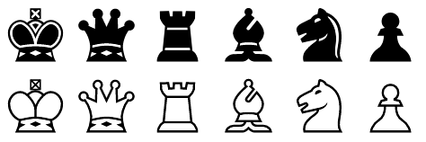

# Ansuz Chess

A chess piece set inspired by the popular Chess Alpha font by Eric Bentzen. The name Ansuz refers
to the rune in Elder Futhark which corresponds to roughly the same sound as the Greek letter alpha.

## Files

The pieces of the default set are located in the `pieces` folder, and alternative versions of the
bishops and kings can be found inside `pieces_alt`. The file `Ansuz.svg` in the `res` folder is a
multi-page Inkscape document containing all the pieces. Inside the `scidvspc` folder there are
piece sets for Scid vs. PC.

> **Note**: it should be fairly easy to adapt this piece set for use with just about any chess program,
but finding out how to do it for Scid vs. PC was not very straightforward and I ended up having to
write [a Python script](https://gist.github.com/quotepilgrim/58d4a9471f5c904c9d27c125c8068f3a) to
do it, hence files for that program in particular being included in the repository.

## Userstyles

This piece set can be used on [Lichess](https://lichess.org/) by installing the browser
extension [Stylus](https://github.com/openstyles/stylus) and clicking one of the following links:

https://raw.githubusercontent.com/quotepilgrim/ansuz/main/res/userstyles/ansuz-lichess.user.css  
https://raw.githubusercontent.com/quotepilgrim/ansuz/main/res/userstyles/ansuz_alt-lichess.user.css

To use it on [Chess.com](https://www.chess.com/home) follow one of the links below:

https://raw.githubusercontent.com/quotepilgrim/ansuz/main/res/userstyles/ansuz-chesscom.user.css  
https://raw.githubusercontent.com/quotepilgrim/ansuz/main/res/userstyles/ansuz_alt-chesscom.user.css
